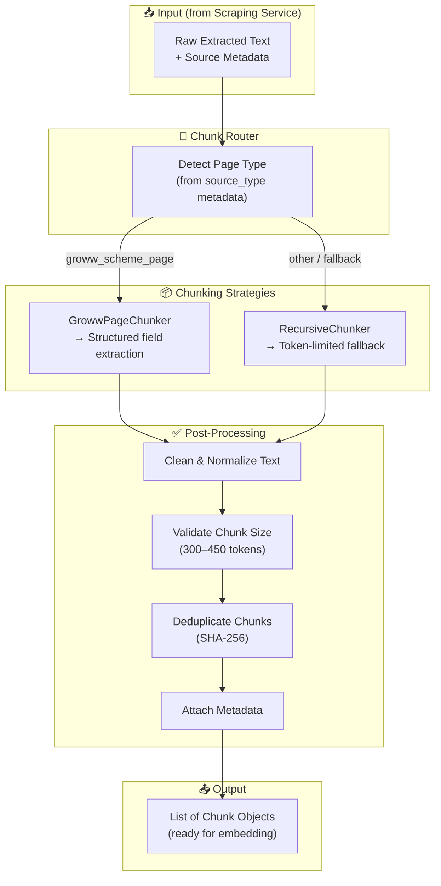
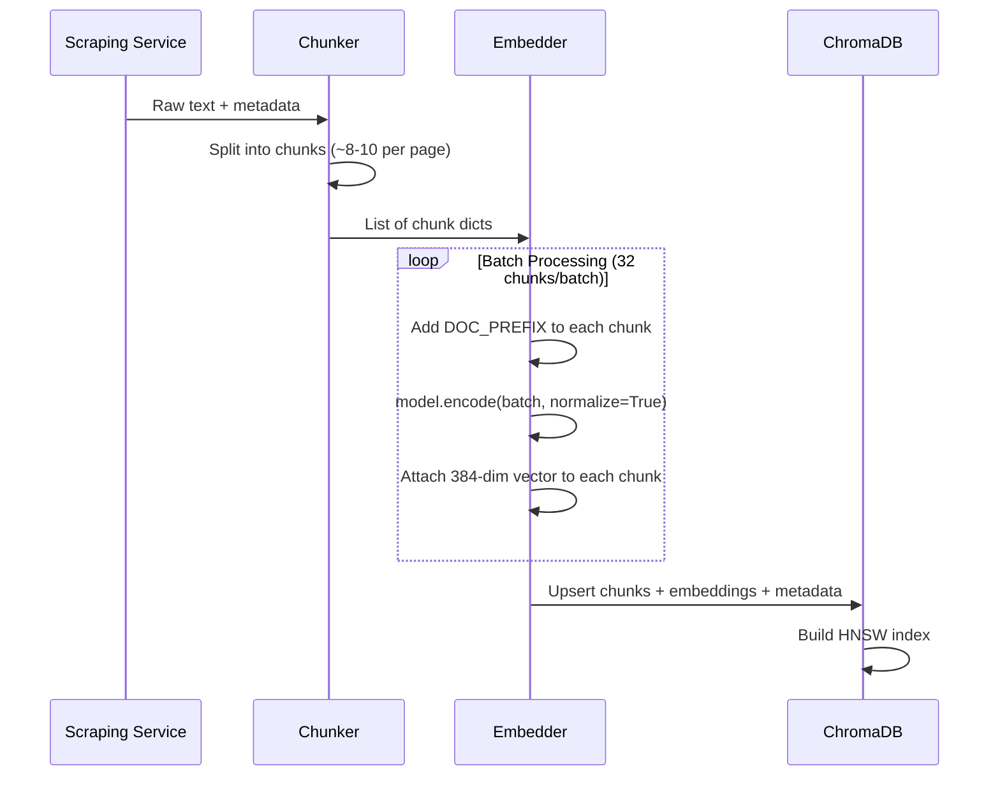
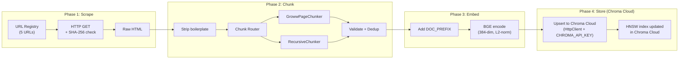

# Chunking & Embedding Architecture — Mutual Fund FAQ Assistant

> Companion document to [`rag_architecture.md`](./rag_architecture.md) §3.3 and §4.

---

## Table of Contents

1. [Overview](#1-overview)
2. [Chunking Architecture](#2-chunking-architecture)
3. [Per-Page-Type Chunking Logic](#3-per-page-type-chunking-logic)
4. [Chunk Router (Orchestrator)](#4-chunk-router-orchestrator)
5. [Chunk Data Model](#5-chunk-data-model)
6. [Embedding Layer](#6-embedding-layer)
7. [Vector Store (Chroma) Integration](#7-vector-store-chroma-integration)
8. [End-to-End Pipeline Flow](#8-end-to-end-pipeline-flow)
9. [Chunk Validation & Quality Rules](#9-chunk-validation--quality-rules)
10. [Estimated Output & Performance](#10-estimated-output--performance)
11. [Example Chunks](#11-example-chunks)

---

## 1. Overview

This document details how raw HTML content from the scraping service is transformed into searchable vector embeddings in ChromaDB. The pipeline has two core phases:

```
Scraped HTML → [CHUNKING] → Metadata-enriched text chunks → [EMBEDDING] → 384-dim vectors → ChromaDB
```

**Key constraints:**
- Corpus is **HTML-only** (5 Groww PPFAS scheme pages). No PDFs.
- Embedding model: **BAAI/bge-small-en-v1.5** (local, 384-dim, max 512 tokens).
- Target chunk size: **300–450 tokens** with 10–15% overlap.
- Same model and prefixes must be used at both ingest and query time.

---

## 2. Chunking Architecture

Chunking is critical — chunks must be semantically meaningful and retrieval-friendly. The chunker receives raw text from the scraping service and produces structured, metadata-enriched chunks ready for embedding.



### 2.1 Chunking Parameters

| Parameter | Value | Rationale |
|---|---|---|
| **Chunk size** | 300–450 tokens | Small enough for precise retrieval, large enough for context; fits BGE's 512 max |
| **Chunk overlap** | ~50 tokens (10–15%) | Prevents loss of info at boundaries |
| **Min chunk size** | 50 tokens | Discard chunks too small to be useful |
| **Separator hierarchy** | `\n\n` → `\n` → `. ` → ` ` | Preserves semantic boundaries |
| **Table handling** | Keep tables as single chunks | Financial tables (expense ratio, exit load) lose meaning when split |

---

## 3. Per-Page-Type Chunking Logic

### 3.1 Groww Fund Page → `GrowwPageChunker`

Groww pages have a consistent structure. The chunker extracts specific **data sections** as individual chunks:

| Extracted Section | Example Data | Chunk Type |
|---|---|---|
| Scheme overview | Name, category, risk level, NAV | `overview` |
| Expense ratio | Direct: 0.63%, Regular: 1.68% | `expense_ratio` |
| Exit load | 1% if redeemed within 365 days | `exit_load` |
| SIP details | Min SIP ₹1,000, Min lumpsum ₹5,000 | `sip_details` |
| Fund managers | Rajeev Thakkar, Raunak Onkar, etc. | `fund_manager` |
| Holdings (top 10) | List of top holdings with % allocation | `holdings` |
| Benchmark | Nifty 500 TRI | `benchmark` |
| Risk & ratings | Very High risk, Morningstar rating | `risk_rating` |

```python
class GrowwPageChunker:
    """Extract structured sections from Groww fund pages as individual chunks."""

    SECTION_PATTERNS = [
        ("overview", ["fund category", "risk", "nav", "aum"]),
        ("expense_ratio", ["expense ratio", "ter", "direct plan", "regular plan"]),
        ("exit_load", ["exit load", "redemption"]),
        ("sip_details", ["sip", "minimum investment", "lumpsum"]),
        ("fund_manager", ["fund manager", "managed by"]),
        ("holdings", ["top holdings", "portfolio", "allocation"]),
        ("benchmark", ["benchmark", "index"]),
        ("risk_rating", ["riskometer", "risk level", "rating"]),
    ]

    def chunk(self, content: str, metadata: dict) -> list[dict]:
        chunks = []
        sections = self._split_by_sections(content)

        for section_name, section_text in sections:
            if len(section_text.split()) < 10:  # Skip too-small sections
                continue
            chunks.append({
                "content": section_text.strip(),
                "metadata": {**metadata, "section": section_name},
                "chunk_type": "structured",
            })
        return chunks

    def _split_by_sections(self, content: str) -> list[tuple[str, str]]:
        """Split content into named sections based on keyword matching."""
        lines = content.split("\n")
        sections = []
        current_section = "overview"
        current_text = []

        for line in lines:
            line_lower = line.lower()
            matched = False
            for section_name, keywords in self.SECTION_PATTERNS:
                if any(kw in line_lower for kw in keywords):
                    if current_text:
                        sections.append((current_section, "\n".join(current_text)))
                    current_section = section_name
                    current_text = [line]
                    matched = True
                    break
            if not matched:
                current_text.append(line)

        if current_text:
            sections.append((current_section, "\n".join(current_text)))
        return sections
```

### 3.2 Fallback → `RecursiveChunker`

For any content that doesn't match the Groww-specific structure, or for oversized Groww sections, a **Recursive Character Text Splitter** with overlap handles generic chunking.

```python
class RecursiveChunker:
    """Token-limited recursive splitting with overlap."""

    def __init__(self, max_tokens=450, overlap_tokens=50, min_tokens=50):
        self.max_tokens = max_tokens
        self.overlap_tokens = overlap_tokens
        self.min_tokens = min_tokens
        self.separators = ["\n\n", "\n", ". ", " "]

    def chunk(self, content: str, metadata: dict) -> list[dict]:
        raw_chunks = self._recursive_split(content, self.separators)
        return [
            {
                "content": c.strip(),
                "metadata": {**metadata, "section": "general"},
                "chunk_type": "recursive",
            }
            for c in raw_chunks
            if len(c.split()) >= self.min_tokens
        ]

    def _recursive_split(self, text: str, separators: list[str]) -> list[str]:
        if len(text.split()) <= self.max_tokens:
            return [text]

        sep = separators[0] if separators else " "
        parts = text.split(sep)
        chunks, current = [], ""

        for part in parts:
            candidate = f"{current}{sep}{part}" if current else part
            if len(candidate.split()) > self.max_tokens and current:
                chunks.append(current)
                # Overlap: carry last N tokens into next chunk
                overlap = " ".join(current.split()[-self.overlap_tokens:])
                current = f"{overlap}{sep}{part}" if self.overlap_tokens else part
            else:
                current = candidate

        if current:
            chunks.append(current)

        # If any chunk is still too large, try next separator
        if len(separators) > 1:
            refined = []
            for chunk in chunks:
                if len(chunk.split()) > self.max_tokens:
                    refined.extend(self._recursive_split(chunk, separators[1:]))
                else:
                    refined.append(chunk)
            return refined
        return chunks
```

---

## 4. Chunk Router (Orchestrator)

The router dispatches content to the appropriate chunking strategy based on `source_type` metadata from the URL registry.

```python
import hashlib
import uuid


class Chunker:
    """Routes content to the appropriate chunking strategy based on page type."""

    def __init__(self):
        self.strategies = {
            "groww_scheme_page": GrowwPageChunker(),
        }
        self.fallback = RecursiveChunker()

    def chunk(self, content: str, metadata: dict) -> list[dict]:
        """Chunk content using the appropriate strategy for its source type."""
        source_type = metadata.get("source_type", "")
        strategy = self.strategies.get(source_type, self.fallback)

        chunks = strategy.chunk(content, metadata)

        # Post-processing: assign deterministic IDs + dedup hash
        for i, chunk in enumerate(chunks):
            # Deterministic ID from content hash → idempotent upserts
            content_hash = hashlib.sha256(chunk["content"].encode()).hexdigest()[:16]
            chunk["id"] = f"{metadata.get('scheme_id', 'unknown')}_{i}_{content_hash}"
            chunk["content_hash"] = content_hash
            chunk["metadata"]["chunk_index"] = i

        # Deduplicate by content hash
        seen = set()
        deduped = []
        for chunk in chunks:
            if chunk["content_hash"] not in seen:
                seen.add(chunk["content_hash"])
                deduped.append(chunk)

        return deduped
```

---

## 5. Chunk Data Model

Each chunk produced by the chunker has this structure:

```python
@dataclass
class Chunk:
    id: str                    # Deterministic hash-based ID (idempotent upserts)
    content: str               # The chunk text (300–450 tokens)
    content_hash: str          # SHA-256 prefix for dedup / change detection
    chunk_type: str            # "structured" | "recursive"
    metadata: dict             # Inherited from source + enriched
    # metadata keys:
    #   source_url: str        # Groww page URL (citation)
    #   scheme_name: str       # "Parag Parikh Flexi Cap Fund"
    #   scheme_id: str         # "ppfas_flexi_cap"
    #   amc: str               # "PPFAS Mutual Fund"
    #   source_type: str       # "groww_scheme_page"
    #   section: str           # "expense_ratio", "exit_load", etc.
    #   chunk_index: int       # Position in chunk list
    #   last_scraped: str      # "2026-04-25"
```

---

## 6. Embedding Layer

The embedding layer converts text chunks into dense vector representations for semantic search. It handles both **document embedding** (at ingestion time) and **query embedding** (at query time), using asymmetric prefixes for optimal retrieval.

### 6.1 Embedding Architecture

```mermaid
flowchart TD
    subgraph INGESTION_PATH["📥 Document Embedding (Ingestion)"]
        CHUNKS["Chunks from Chunker<br/>(~40–50 chunks)"] --> BATCH["Batch Processor<br/>(batch_size=32)"]
        BATCH --> PREFIX_D["Add Document Prefix<br/>('Represent this document...')"]
        PREFIX_D --> ENCODE_D["Encode with<br/>SentenceTransformer"]
        ENCODE_D --> NORMALIZE_D["L2 Normalize<br/>Embeddings"]
        NORMALIZE_D --> VECTORS_D["384-dim Vectors<br/>+ Chunk Metadata"]
        VECTORS_D --> STORE["Upsert to<br/>ChromaDB"]
    end

    subgraph QUERY_PATH["🔍 Query Embedding (Runtime)"]
        QUERY["User Query<br/>(preprocessed)"] --> PREFIX_Q["Add Query Prefix<br/>('Represent this query...')"]
        PREFIX_Q --> ENCODE_Q["Encode with<br/>SentenceTransformer"]
        ENCODE_Q --> NORMALIZE_Q["L2 Normalize<br/>Embedding"]
        NORMALIZE_Q --> VECTOR_Q["384-dim Query Vector"]
        VECTOR_Q --> SEARCH["Cosine Similarity<br/>Search in ChromaDB"]
    end
```



> [!IMPORTANT]
> **Asymmetric prefixes** are critical for `bge` models. Document chunks use `"Represent this document for retrieval: "` and queries use `"Represent this query for retrieval: "`. This improves retrieval accuracy by ~5–10% compared to no prefix.

### 6.2 Model Selection

| Property | Value |
|---|---|
| **Model** | `BAAI/bge-small-en-v1.5` |
| **Source** | HuggingFace Hub — downloaded locally on first run (~130 MB) |
| **Inference** | Local via `sentence-transformers` — **no API key required** |
| **Dimensions** | 384 |
| **Max tokens** | 512 (chunk text must stay under this limit) |
| **Normalization** | L2-normalized unit vectors |
| **Distance metric** | Cosine similarity (= dot product after normalization) |
| **Env config** | `EMBED_MODEL=BAAI/bge-small-en-v1.5` in `.env` / GitHub Secrets |
| **Batch size** | `EMBED_BATCH_SIZE=32` (configurable) |
| **Upgrade path** | `bge-base-en-v1.5` (768-dim) when corpus grows |

> [!WARNING]
> Changing `EMBED_MODEL` or `EMBED_BATCH_SIZE` (model switch only) **requires a full re-index**:
> delete the **Chroma Cloud collection** (via the trychroma.com dashboard or API) and re-run `python -m src.ingestion.run_pipeline` with `data/hashes.json` cleared.
> The same model **must** be used at both ingest time and query time — a mismatch silently degrades retrieval.

### 6.3 Embedder Implementation

```python
# src/ingestion/embedder.py
import logging
import math
import os
from typing import Optional

import numpy as np
from sentence_transformers import SentenceTransformer

logger = logging.getLogger(__name__)

# Configurable via env — changing EMBED_MODEL requires a full re-index
_EMBED_MODEL = os.getenv("EMBED_MODEL", "BAAI/bge-small-en-v1.5")
_EMBED_BATCH_SIZE = int(os.getenv("EMBED_BATCH_SIZE", "32"))


class Embedder:
    """Embeds text chunks and queries using BAAI/bge-small-en-v1.5 (local, no API key)."""

    # Asymmetric prefixes — critical for BGE retrieval quality (~5–10% improvement)
    DOC_PREFIX = "Represent this document for retrieval: "
    QUERY_PREFIX = "Represent this query for retrieval: "

    def __init__(
        self,
        model_name: str = _EMBED_MODEL,
        batch_size: int = _EMBED_BATCH_SIZE,
        device: Optional[str] = None,
    ):
        self.model_name = model_name
        self.batch_size = batch_size
        logger.info("[Embedder] Loading model %s ...", model_name)
        self.model = SentenceTransformer(model_name, device=device)
        self.dimensions = self.model.get_sentence_embedding_dimension()
        logger.info(
            "[Embedder] Loaded %s (%d-dim) on %s",
            model_name, self.dimensions, self.model.device,
        )

    def embed_chunks(self, chunks: list[dict]) -> list[dict]:
        """Embed document chunks in batches. Adds 'embedding' key to each chunk.
        Skips chunks with dimension mismatch or NaN values."""
        if not chunks:
            return chunks

        texts = [self.DOC_PREFIX + chunk["content"] for chunk in chunks]
        logger.info("[Embedder] Embedding %d chunks (batch_size=%d) ...", len(texts), self.batch_size)

        all_embeddings = self.model.encode(
            texts,
            batch_size=self.batch_size,
            normalize_embeddings=True,   # L2 normalize — required for cosine similarity
            show_progress_bar=len(texts) > 50,
        )

        valid_chunks: list[dict] = []
        for chunk, embedding in zip(chunks, all_embeddings):
            vec = embedding.tolist()
            if len(vec) != self.dimensions:
                logger.error("[Embedder] Dimension mismatch for chunk %s — skipping", chunk.get("id"))
                continue
            if any(math.isnan(v) for v in vec):
                logger.error("[Embedder] NaN embedding for chunk %s — skipping", chunk.get("id"))
                continue
            chunk["embedding"] = vec
            valid_chunks.append(chunk)

        logger.info("[Embedder] Successfully embedded %d / %d chunks", len(valid_chunks), len(chunks))
        return valid_chunks

    def embed_query(self, query: str) -> list[float]:
        """Embed a single user query with query-specific prefix."""
        prefixed = self.QUERY_PREFIX + query
        return self.model.encode(prefixed, normalize_embeddings=True).tolist()

    def compute_similarity(self, query_vec: list[float], doc_vec: list[float]) -> float:
        """Cosine similarity between two L2-normalized vectors (= dot product)."""
        return float(np.dot(np.array(query_vec), np.array(doc_vec)))
```

### 6.4 Embedding Pipeline Sequence



---

## 7. Vector Store (Chroma Cloud) Integration

> **Hosting:** [Chroma Cloud](https://trychroma.com) — fully managed, serverless. No local storage. The same collection is shared between the GitHub Actions ingest job and the API server at query time.

### 7.1 Collection Setup

```python
# src/ingestion/vector_store.py
import os
import chromadb

# Credentials from environment (GitHub Secrets in CI; .env locally)
client = chromadb.HttpClient(
    host=os.environ["CHROMA_HOST"],          # e.g. api.trychroma.com
    headers={"X-Chroma-Token": os.environ["CHROMA_API_KEY"]},
    tenant=os.environ["CHROMA_TENANT"],
    database=os.environ["CHROMA_DATABASE"],
)

# Created once; subsequent runs use get_or_create_collection (idempotent)
collection = client.get_or_create_collection(
    name=os.getenv("INGEST_CHROMA_COLLECTION", "mf_faq_chunks"),
    metadata={
        "hnsw:space": "cosine",         # Distance metric
        "hnsw:M": 16,                   # HNSW graph connections
        "hnsw:construction_ef": 200,    # Build-time accuracy
        "hnsw:search_ef": 100,          # Query-time accuracy
    },
)
```

> [!IMPORTANT]
> `CHROMA_API_KEY`, `CHROMA_TENANT`, and `CHROMA_DATABASE` must **never** be committed to the repository. Add them to GitHub Secrets for CI and to `.env` (gitignored) for local development.

### 7.2 Upsert Flow

```python
def upsert_to_chroma(collection, chunks: list[dict]):
    """Upsert embedded chunks into Chroma Cloud collection."""
    collection.upsert(
        ids=[c["id"] for c in chunks],
        embeddings=[c["embedding"] for c in chunks],
        documents=[c["content"] for c in chunks],
        metadatas=[c["metadata"] for c in chunks],
    )
```

### 7.3 Record Shape in Chroma

| Field | Content |
|---|---|
| `id` | Deterministic `chunk_id` (SHA-256 hash — idempotent upserts) |
| `embedding` | float vector, length **384** |
| `document` | `chunk_text` (retrieval display + LLM context) |
| `metadata` | `source_url`, `scheme_id`, `scheme_name`, `amc`, `source_type`, `section`, `fetched_at`, `chunk_index` |

### 7.4 Query-Time Retrieval

```python
def query_chroma(collection, embedder, user_query: str, k: int = 10, filters: dict = None):
    """Embed query and retrieve top-k chunks from Chroma Cloud."""
    query_vector = embedder.embed_query(user_query)

    results = collection.query(
        query_embeddings=[query_vector],
        n_results=k,
        where=filters,   # e.g. {"scheme_id": "ppfas_flexi_cap"}
        include=["documents", "metadatas", "distances"],
    )
    return results
```

> The API server connects to the **same Chroma Cloud collection** using identical credentials. No data is re-downloaded or re-embedded at query time.


---

## 8. End-to-End Pipeline Flow



**Triggered by:** GitHub Actions daily at 09:15 IST (`45 3 * * *` UTC) or `workflow_dispatch`. Requires `CHROMA_API_KEY`, `CHROMA_TENANT`, `CHROMA_DATABASE` in GitHub Secrets.

---

## 9. Chunk Validation & Quality Rules

| Rule | Check | Action on Fail |
|---|---|---|
| Min tokens | `len(chunk.split()) >= 50` | Discard chunk |
| Max tokens | `len(chunk.split()) <= 450` | Re-split with RecursiveChunker |
| Has content | `chunk.strip() != ""` | Discard chunk |
| Has source URL | `metadata["source_url"]` exists | Log warning, skip |
| No PII leakage | No PAN/Aadhaar patterns | Strip PII, log alert |
| Deduplication | SHA-256 hash of content | Skip duplicate chunks |

### Embedding Quality Checks

| Check | Threshold | Action on Fail |
|---|---|---|
| Vector dimensions | Exactly **384** | Raise error, halt pipeline |
| Vector norm | ~1.0 (±0.001) | Re-normalize or log warning |
| Null/NaN check | No NaN values | Discard chunk, log error |
| Duplicate vectors | Cosine sim > 0.99 | Flag as potential duplicate |

---

## 10. Estimated Output & Performance

### 10.1 Chunk Estimates

| Source Type | Pages | Chunks/Page | Est. Total Chunks |
|---|---|---|---|
| Groww scheme pages (PPFAS) | 5 | 8–10 sections each | ~40–50 |

> [!NOTE]
> Current corpus is 5 Groww pages only. When the corpus expands (AMC pages, AMFI, SEBI), chunk count will grow to ~100–250.

### 10.2 Performance Benchmarks

| Metric | Value | Notes |
|---|---|---|
| **Embedding speed** | ~2ms per chunk | On CPU (MacBook M-series) |
| **Batch throughput** | ~500 chunks/sec | With `batch_size=32` on GPU |
| **Full corpus embed** | < 1 second | For ~50 chunks on CPU |
| **Query embed** | ~3ms | Single query, real-time |
| **Memory footprint** | ~300 MB | Model + tokenizer loaded |
| **Vector size** | 384 × 4 bytes = 1.5 KB/chunk | Float32 storage |
| **Total vector storage** | ~75 KB | For 50 chunks |

---

## 11. Example Chunks

**Chunk A — Groww Structured (Expense Ratio):**
```
Scheme: Parag Parikh Flexi Cap Fund
Expense Ratio (Direct Plan): 0.63%
Expense Ratio (Regular Plan): 1.68%
As of: April 2026
Source: Groww
Section: expense_ratio
```

**Chunk B — Groww Structured (Exit Load):**
```
Scheme: Parag Parikh Flexi Cap Fund
Exit Load: 1% if redeemed within 365 days from allotment.
Nil for units in excess of 10% of investments within one year.
Source: Groww
Section: exit_load
```

**Chunk C — Groww Structured (Overview):**
```
Scheme: Parag Parikh Arbitrage Fund
Category: Hybrid - Arbitrage
Risk Level: Low
Investment Strategy: Exploits price differential between cash and derivatives markets
Min SIP: ₹1,000 | Min Lumpsum: ₹5,000
Source: Groww
Section: overview
```

**Chunk D — Groww Structured (Fund Manager):**
```
Fund Manager: Rajeev Thakkar
Rajeev Thakkar is the CIO and Fund Manager of PPFAS Mutual Fund.
He manages the Parag Parikh Flexi Cap Fund and oversees the equity
investment strategy across domestic and international markets.
Source: Groww
Section: fund_manager
```
