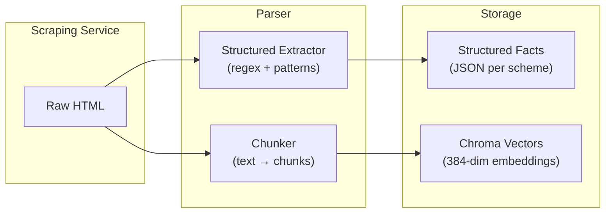
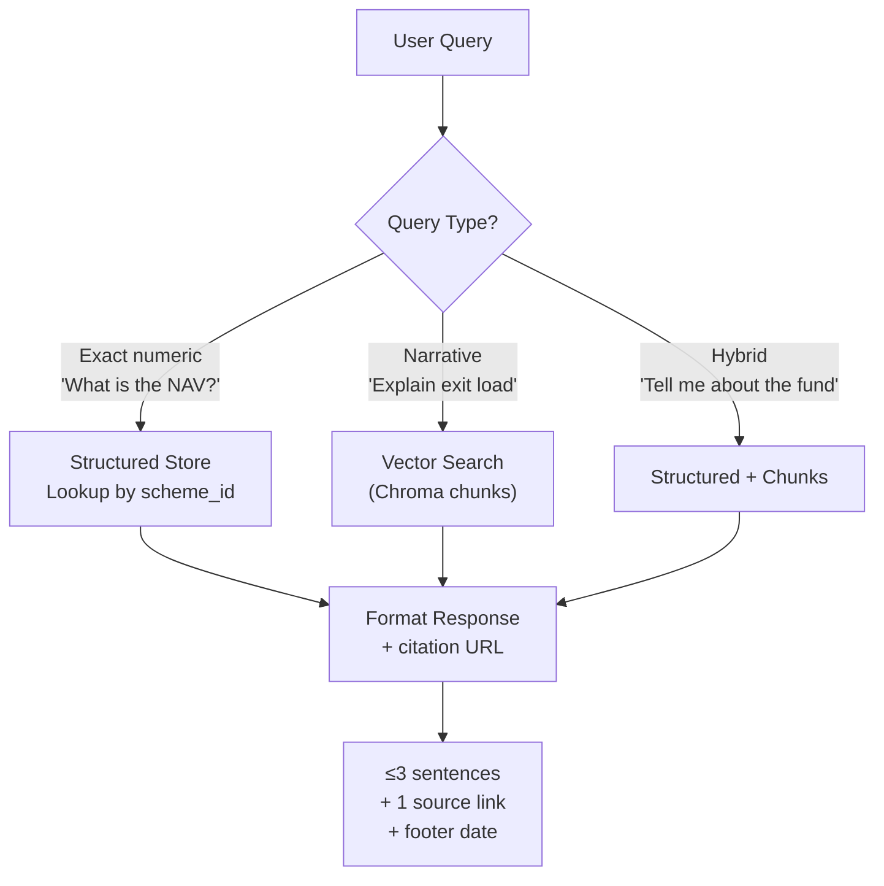

# Data Storage Architecture — Structured Fund Metrics

> Companion to [`rag_architecture.md`](./rag_architecture.md) §3.4 and [`chunking-embedding-architecture.md`](./chunking-embedding-architecture.md)

---

## 1. Why Two Storage Layers?

Dense vector retrieval alone is unreliable for exact numeric lookups ("What is the NAV?", "What is the minimum SIP?"). The same page text may produce slightly different chunk boundaries across runs, and cosine similarity can return the wrong span or a stale phrasing. We use a **hybrid approach**:

| Layer | What it Stores | When Used |
|---|---|---|
| **Structured facts store** (JSON) | One record per scheme with typed fields (NAV, SIP, etc.) | Exact-answer questions, filters, regression tests |
| **Vector index** (Chroma chunks) | Full normalized text/tables from the same page | Narrative context, exit load details, objectives, FAQ answers |



---

## 2. Data Sections Extracted from Groww Pages

Based on analysis of actual scraped Groww scheme pages, the following sections are available:

| # | Section | Data Available | Storage |
|---|---|---|---|
| 1 | **NAV** | Current NAV (₹), as-of date | Structured |
| 2 | **Minimum SIP** | Min 1st investment, Min 2nd, Min SIP (₹) | Structured |
| 3 | **Fund Size (AUM)** | AUM in ₹ Cr | Structured |
| 4 | **Expense Ratio** | TER percentage (Direct plan) | Structured |
| 5 | **Rating** | Groww rating (1–5 scale) | Structured |
| 6 | **Holdings** | Name, Sector, Instrument type, % allocation (all holdings) | Chunks (table) |
| 7 | **Returns & Rankings** | Annualised returns (3Y, 5Y, 10Y), category rank | Chunks |
| 8 | **Exit Load** | Full exit load rules with dates, historical changes | Chunks |
| 9 | **Stamp Duty & Tax** | Stamp duty rate, LTCG/STCG tax rules | Chunks |
| 10 | **Fund Management** | Manager names, education, experience, tenure | Chunks |
| 11 | **About / Objectives** | Scheme description, benchmark, launch date, investment objective | Chunks |
| 12 | **FAQ-like terms** | Definitions: expense ratio, exit load, stamp duty, annualised returns | Chunks |

> [!NOTE]
> Groww pages currently do **not** surface advance ratios (alpha, beta, Sharpe, Sortino, standard deviation, Treynor) in their server-rendered HTML. These are available via Groww's internal APIs or other sources. For now, the structured store records `null` for these fields. If they become available later, the schema supports them without redesign.

---

## 3. Structured Facts Schema

One JSON record per scheme, per scrape run. Stored at `data/structured/<run_id>/<scheme_id>.json`.

```json
{
  "scheme_id": "ppfas_flexi_cap",
  "scheme_name": "Parag Parikh Flexi Cap Fund",
  "amc": "PPFAS Mutual Fund",
  "source_url": "https://groww.in/mutual-funds/parag-parikh-long-term-value-fund-direct-growth",
  "fetched_at": "2026-04-25T03:59:53Z",
  "content_hash": "332c48155b65baf1...",

  "nav": {
    "value": 91.08,
    "currency": "INR",
    "as_of": "2026-04-23"
  },

  "minimum_sip": {
    "value": 1000,
    "currency": "INR",
    "frequency": "monthly"
  },
  "minimum_lumpsum": {
    "value": 1000,
    "currency": "INR"
  },

  "fund_size_aum": {
    "value": 128966.48,
    "unit": "Cr",
    "currency": "INR"
  },

  "expense_ratio": {
    "value": 0.79,
    "plan": "direct",
    "unit": "percent"
  },

  "rating": {
    "value": 5,
    "scale": "1-5",
    "source": "groww"
  },

  "risk_level": "Very High",

  "exit_load": {
    "summary": "For units above 10% of the investment, exit load of 2% if redeemed within 365 days and 1% if redeemed after 365 days but on or before 730 days.",
    "effective_date": "2021-11-15"
  },

  "stamp_duty": {
    "rate": 0.005,
    "unit": "percent",
    "effective_from": "2020-07-01"
  },

  "tax": {
    "stcg": "20% if redeemed before 1 year",
    "ltcg": "12.5% on returns above ₹1.25 lakh after 1 year"
  },

  "category": "Equity",
  "sub_category": "Flexi Cap",
  "benchmark": "NIFTY 500 Total Return Index",
  "launch_date": "2012-10-10",
  "investment_objective": "Long-term capital appreciation by investing primarily in equity and equity related instruments.",

  "fund_managers": [
    {"name": "Rajeev Thakkar", "since": "2013-05"},
    {"name": "Raunak Onkar", "since": "2013-05"},
    {"name": "Raj Mehta", "since": "2016-01"},
    {"name": "Rukun Tarachandani", "since": "2022-05"},
    {"name": "Tejas Soman", "since": "2025-09"},
    {"name": "Mansi Kariya", "since": "2023-12"},
    {"name": "Aishwarya Dhar", "since": "2025-09"}
  ],

  "returns_annualised": {
    "3y": 18.5,
    "5y": 17.4,
    "10y": 18.0,
    "all": 18.6
  },

  "category_rank": {
    "3y": 25,
    "5y": 12,
    "10y": 1
  },

  "advance_ratios": {
    "alpha": null,
    "beta": null,
    "sharpe_ratio": null,
    "sortino_ratio": null,
    "standard_deviation": null,
    "treynor_ratio": null,
    "_note": "Not available in Groww server-rendered HTML; null until source added"
  }
}
```

> [!IMPORTANT]
> Use `null` for any field that cannot be parsed. **Never invent values.** Log parse warnings so operators can detect extraction failures.

---

## 4. What Goes Where — Decision Matrix

| User Question | Storage Used | Why |
|---|---|---|
| "What is the NAV?" | **Structured** → `nav.value` | Exact numeric lookup |
| "What is the minimum SIP?" | **Structured** → `minimum_sip.value` | Exact numeric lookup |
| "What is the expense ratio?" | **Structured** → `expense_ratio.value` | Exact numeric lookup |
| "What is the fund size?" | **Structured** → `fund_size_aum.value` | Exact numeric lookup |
| "What is the exit load?" | **Chunks** (full rules with dates) | Narrative with conditions |
| "What is the stamp duty?" | **Structured** + **Chunks** | Number from structured, explanation from chunks |
| "What are the top holdings?" | **Chunks** (holdings table) | Full table with sectors, instruments, % |
| "Who manages this fund?" | **Structured** → `fund_managers` + **Chunks** | Names from structured, bios from chunks |
| "What is the benchmark?" | **Structured** → `benchmark` | Exact string lookup |
| "What are the tax implications?" | **Chunks** (tax section) | Narrative with LTCG/STCG rules |
| "What is the investment objective?" | **Structured** → `investment_objective` | Exact text |

---

## 5. Directory Layout

```
data/
├── hashes.json                        ← SHA-256 per URL (change detection)
├── raw/                               ← Raw HTML (audit/replay)
│   ├── ppfas_flexi_cap/
│   │   └── 2026-04-25T035953Z.html
│   └── ...
├── scraped/                           ← Extracted text + metadata per run
│   └── 20260425T035953Z/
│       ├── _manifest.json
│       ├── ppfas_flexi_cap.json
│       └── ...
├── structured/                        ← Parsed structured facts per run
│   └── 20260425T035953Z/
│       ├── _manifest.json
│       ├── ppfas_flexi_cap.json       ← Schema from §3 above
│       └── ...
└── chroma/                            ← Vector embeddings (future Phase 4.3)
    └── mf_faq_chunks/
```

---

## 6. Chunking Strategy per Data Type

| Data Type | Chunking Approach | Chunk Boundary |
|---|---|---|
| **NAV, SIP, AUM, Expense Ratio, Rating** | Extract to structured store; also embed as an "overview" chunk | Single chunk (~overview section) |
| **Holdings** (121 entries) | Keep top 10–15 as one chunk; remaining as a second chunk or skip | Split at natural row groups |
| **Returns & Rankings** | One chunk with all return periods + category ranks | Single chunk |
| **Exit Load** | Full text with dates and conditions as one chunk | Single chunk (preserve rules) |
| **Stamp Duty & Tax** | Combined into one chunk (stamp duty + STCG/LTCG) | Single chunk |
| **Fund Managers** | Names + tenures as one chunk; detailed bios as separate chunks | 1 summary + N bio chunks |
| **About / Objectives** | Scheme description + benchmark + launch date | Single chunk |
| **Term Definitions** | Each definition (expense ratio, exit load, etc.) as FAQ-like pairs | One chunk per term |

---

## 7. Query-Time Flow



For **exact numeric queries**, the structured store gives a deterministic answer without relying on embedding similarity. The citation is still the `source_url` from the same record, so the one-link contract is preserved.

For **narrative queries**, chunks provide the full context. The structured store may be used to inject precise numbers into the LLM prompt alongside chunk text.

---

## 8. Freshness & Versioning

| Mechanism | Purpose |
|---|---|
| **`fetched_at`** on every record | Powers the "Last updated from sources" footer |
| **`content_hash`** per URL | Skip re-extraction if page hasn't changed |
| **Run-ID directories** (`data/structured/<run_id>/`) | Full audit trail; roll back if a scrape produces bad data |
| **`_manifest.json`** per run | Operator visibility: which schemes updated, which skipped |
