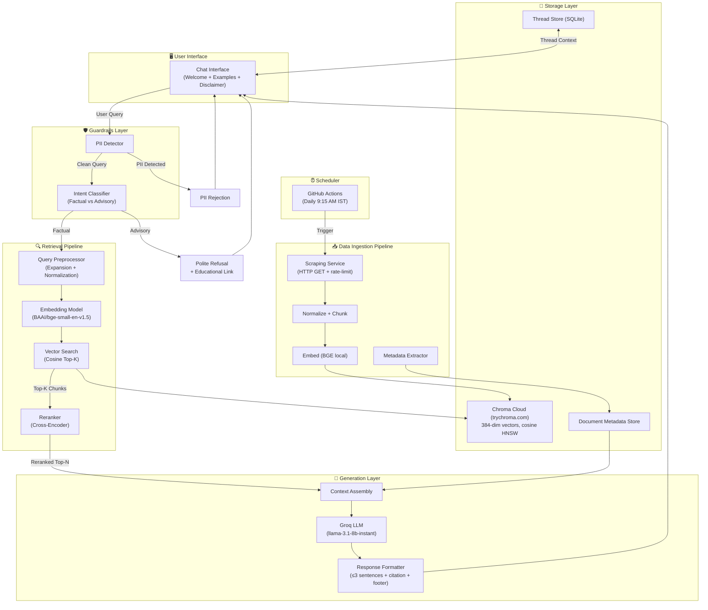
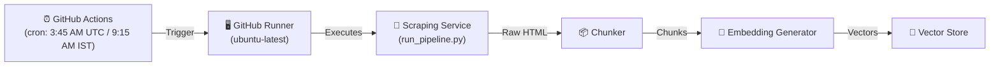
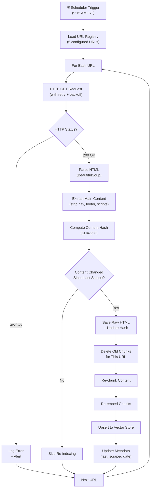
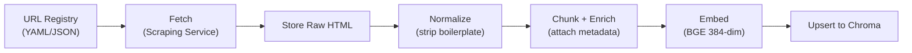
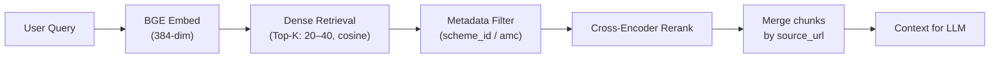
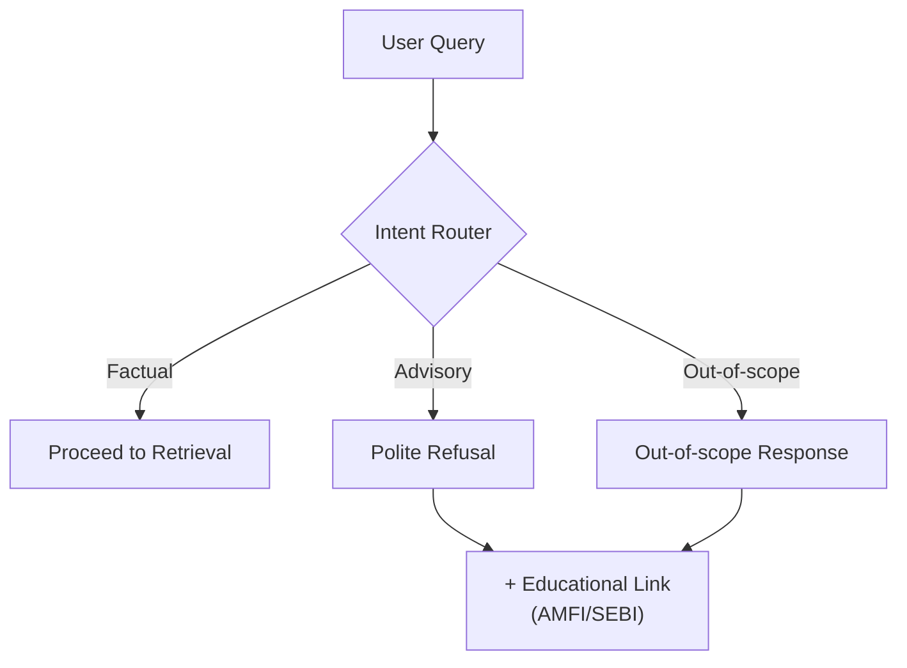

# RAG Architecture — Mutual Fund FAQ Assistant

> **Facts-only. No investment advice.**

---

## Table of Contents

1. [Design Principles](#1-design-principles)
2. [Architecture Diagram](#2-architecture-diagram)
3. [Corpus & Data Model](#3-corpus--data-model)
4. [Ingestion Pipeline](#4-ingestion-pipeline)
5. [Retrieval Layer](#5-retrieval-layer)
6. [Generation Layer](#6-generation-layer)
7. [Refusal & Safety Layer](#7-refusal--safety-layer)
8. [Multi-Thread Chat Architecture](#8-multi-thread-chat-architecture)
9. [Application & API Layer](#9-application--api-layer)
10. [Observability & Quality](#10-observability--quality)
11. [Technology Stack](#11-technology-stack)
12. [Known Limitations](#12-known-limitations)
13. [Alignment with Deliverables](#13-alignment-with-deliverables)
14. [Summary](#14-summary)

---

## 1. Design Principles

This document describes a retrieval-augmented generation (RAG) architecture for the facts-only mutual fund FAQ assistant defined in `problemStatement.md`. It prioritizes accuracy, provenance, and compliance over open-ended conversational ability.

| Principle | Implication for Architecture |
|---|---|
| **Facts-only** | Retrieval gates what the model may say; prompts and post-checks forbid advice and comparisons. |
| **Single canonical source per answer** | Retrieval returns chunks tagged with one citation URL; generation is constrained to cite that URL only. |
| **Curated corpus** | Ingestion is batch or scheduled from an allowlist of URLs; no arbitrary web crawling at query time. |
| **No PII** | No user document upload path; chat payloads exclude identifiers; logs redact or omit sensitive fields. |
| **Accuracy over "intelligence"** | Prefer abstention, refusal, or "see the indexed scheme page" over speculative answers. |

### Components in Brief

| Component | Role |
|---|---|
| **Scheduler (GitHub Actions)** | Cron at 09:15 IST daily to run full ingest. See [§4.0](#40-scheduler-and-scraping-service). |
| **Scraping service** | Reads URL registry, fetches allowlisted pages, persists raw HTML, feeds normalize → chunk → embed → index. |
| **Ingestion pipeline** | Builds/refreshes vector index and parallel document registry. |
| **Thread store** | Persists conversation history per thread for multi-chat support. |
| **Query router** | Classifies intent (factual FAQ vs advisory vs out-of-scope) before retrieval. |
| **Retriever + re-ranker** | Top-k chunks from vector store, filtered/re-ranked by scheme, recency, source type. |
| **LLM layer** | Short answer from retrieved text only, with fixed output schema. |
| **Post-guards** | Validate citation, sentence count, forbidden patterns. |

---

## 2. Architecture Diagram



### System Flow Summary

```
User Query → PII Guard → Intent Classifier → Query Preprocessor
    → Retriever (Vector Search + Reranker) → Context Assembly
    → LLM Generator (Groq) → Response Formatter
    → Citation Injector → User Response
```

---

## 3. Corpus & Data Model

### 3.1 Scope (Current Corpus)

**AMC:** PPFAS Mutual Fund (Parag Parikh Financial Advisory Services)

**Allowlisted URLs** (HTML only): each URL is a Groww mutual fund scheme page used as the sole indexed source for that scheme.

| # | Scheme | Category | URL |
|---|---|---|---|
| 1 | Parag Parikh Flexi Cap Fund | Equity — Flexi Cap | https://groww.in/mutual-funds/parag-parikh-long-term-value-fund-direct-growth |
| 2 | Parag Parikh Large Cap Fund | Equity — Large Cap | https://groww.in/mutual-funds/parag-parikh-large-cap-fund-direct-growth |
| 3 | Parag Parikh ELSS Tax Saver Fund | Equity — ELSS (3Y Lock-in) | https://groww.in/mutual-funds/parag-parikh-elss-tax-saver-fund-direct-growth |
| 4 | Parag Parikh Conservative Hybrid Fund | Hybrid — Conservative | https://groww.in/mutual-funds/parag-parikh-conservative-hybrid-fund-direct-growth |
| 5 | Parag Parikh Arbitrage Fund | Hybrid — Arbitrage | https://groww.in/mutual-funds/parag-parikh-arbitrage-fund-direct-growth |

> [!NOTE]
> The problem statement targets official AMC / AMFI / SEBI sources. This phase uses Groww pages as the curated HTML corpus; expanding to primary AMC documents and additional allowlist entries is a future corpus upgrade.

### 3.2 Document Metadata (Per Chunk)

| Field | Purpose |
|---|---|
| `source_url` | Canonical URL for citation (exactly one per assistant message). |
| `source_type` | e.g., `groww_scheme_page`; later `amfi`, `sebi`, `amc_page` if corpus expands. |
| `scheme_id` / `scheme_name` | Tie chunks to a scheme when applicable; `null` for generic pages. |
| `amc` | AMC identifier or name. |
| `title` | Page or section title for debugging and UI tooltips. |
| `fetched_at` | ISO date for "Last updated from sources" footer. |
| `content_hash` | Detect content drift on re-crawl. |

### 3.3 Chunking Strategy

> For full implementation details (chunker code, embedding layer, Chroma integration, validation rules), see [`chunking-embedding-architecture.md`](./chunking-embedding-architecture.md).

**HTML (Groww scheme pages):**
- Split on headings and logical sections.
- Preserve tables as single units (or row-groups for very large tables) so expense ratio / exit load rows stay intact.
- Rendered tables in HTML are the primary place for numeric facts.

> [!NOTE]
> PDFs (factsheets, KIM, SID) are **out of scope** for this project. The corpus is HTML-only.

**Parameters:**

| Parameter | Value | Rationale |
|---|---|---|
| **Target chunk size** | 300–450 tokens | Tuned for BAAI/bge-small-en-v1.5, max 512 input tokens |
| **Overlap** | 10–15% | Preserve boundary context |
| **De-duplication** | Same URL + overlapping hash → keep one | Avoid redundancy |

### 3.4 Structured Fund Metrics

> For the full storage schema, decision matrix (what goes where), and chunking strategy per data type, see [`data-storage-architecture.md`](./data-storage-architecture.md).
The assistant needs reliable, queryable values for a small set of fields (NAV, SIP, AUM, expense ratio, rating). These should not live only inside embedding chunks.

**Hybrid approach:**

| Layer | What it Stores | Role |
|---|---|---|
| **Structured "facts" store** | One record per scheme per scrape run with typed fields | Exact answers, filters, regression tests |
| **Vector index (chunks)** | Full normalized text / tables from the same page | Narrative context, exit load, benchmark, objectives |

**Recommended Schema (per scheme, per snapshot):**

| Field | Notes |
|---|---|
| `scheme_id`, `scheme_name`, `amc` | From URL registry; stable keys. |
| `source_url` | Groww page URL (citation). |
| `fetched_at` | ISO timestamp of scrape. |
| `raw_content_hash` | Hash of raw HTML (traceability). |
| `nav` | Number + currency + optional `as_of` date. |
| `minimum_sip` | Number (INR) + frequency if stated. |
| `fund_size` / `aum` | Number + unit (e.g. ₹ Cr). |
| `expense_ratio` | Percentage as number + label (Direct/Regular). |
| `rating` | Raw label + `rating_kind` enum: `riskometer` \| `analyst` \| `unknown`. |

> [!IMPORTANT]
> Use `null` for any field missing after parse; log parse warnings. **Do not invent values.**

**Extraction:** Run as part of normalize (phase 4.1) or immediately after scrape: parse server-rendered HTML (Groww often embeds data in `__NEXT_DATA__` / JSON blobs). If critical fields require client JS, document headless fetch as a follow-up.

**Query-time use:** For questions mapping cleanly to a column ("What is the minimum SIP?"), answer from the structured row (still one citation: `source_url`) and optionally skip chunk retrieval, or merge chunk context with structured facts in the prompt builder.

---

## 4. Ingestion Pipeline (Detailed)

### 4.0 Scheduler and Scraping Service

#### Scheduler — GitHub Actions

A **GitHub Actions** scheduled workflow triggers the full ingestion pipeline before Indian market hours, ensuring data is fresh for the day's queries.



| Property | Value |
|---|---|
| **Schedule** | `45 3 * * *` UTC = **9:15 AM IST** daily (India has no DST; UTC+5:30 is fixed) |
| **Platform** | GitHub Actions (free tier: 2,000 min/month) |
| **Workflow** | `.github/workflows/ingest.yml` |
| **Runner** | `ubuntu-latest` with pinned Python 3.11 |
| **Timeout** | `timeout-minutes: 15` to prevent hung scrapes from consuming quota |
| **Rationale** | Runs at Indian equity market open (9:15 AM IST), captures any overnight Groww page updates |
| **On Failure** | GitHub Actions auto-retries; email notification on failure |
| **Manual trigger** | `workflow_dispatch` — run from GitHub UI or `gh workflow run` CLI |
| **Idempotency** | Safe to re-run (`content_hash` / upsert semantics; at-least-once) |
| **Artifacts** | Scrape logs + `data/scraped/` JSON (committed to repo); vectors persist in **Chroma Cloud** — no local artifact upload needed |

**Secrets:** Embedding uses local BAAI/bge-small-en-v1.5 (no API key). Vector store uses **Chroma Cloud** — requires `CHROMA_API_KEY`, `CHROMA_TENANT`, and `CHROMA_DATABASE` in GitHub Secrets (see §4.3). Optional: `INGEST_USER_AGENT` via `${{ secrets.* }}`. Never commit `.env` with production keys.

##### 4.0.1 GitHub Actions Workflow

```yaml
# .github/workflows/ingest.yml
name: Daily PPFAS Data Refresh

on:
  schedule:
    # 3:45 AM UTC = 9:15 AM IST (every day)
    - cron: '45 3 * * *'
  workflow_dispatch:  # Allow manual trigger from GitHub UI

jobs:
  refresh-data:
    runs-on: ubuntu-latest
    timeout-minutes: 15

    steps:
      - name: Checkout repository
        uses: actions/checkout@v4

      - name: Set up Python
        uses: actions/setup-python@v5
        with:
          python-version: '3.11'
          cache: 'pip'

      - name: Install dependencies
        run: pip install -r requirements.txt

      - name: Run ingestion pipeline (Scrape → Chunk → Embed → Upsert to Chroma Cloud)
        env:
          # Embedding — runs locally on the runner, no API key needed
          EMBED_MODEL: BAAI/bge-small-en-v1.5
          EMBED_BATCH_SIZE: 32
          # Chroma Cloud credentials (set in GitHub Secrets)
          CHROMA_API_KEY: ${{ secrets.CHROMA_API_KEY }}
          CHROMA_TENANT: ${{ secrets.CHROMA_TENANT }}
          CHROMA_DATABASE: ${{ secrets.CHROMA_DATABASE }}
          CHROMA_HOST: api.trychroma.com
          INGEST_CHROMA_COLLECTION: mf_faq_chunks
        run: python -m src.ingestion.run_pipeline

      - name: Commit updated hashes and scraped content
        run: |
          git config user.name "github-actions[bot]"
          git config user.email "github-actions[bot]@users.noreply.github.com"
          git add data/raw/ data/hashes.json data/scraped/
          git diff --staged --quiet || git commit -m "chore: daily data refresh $(date -u +%Y-%m-%d)"
          git push
```

##### 4.0.2 Pipeline Entry Point

```python
# src/ingestion/run_pipeline.py  (simplified illustration)
"""Entry point for GitHub Actions daily data refresh."""
import logging
import os
import sys
import chromadb
from src.ingestion.scraping_service import ScrapingService
from src.ingestion.url_registry import URL_REGISTRY
from src.ingestion.chunker import Chunker
from src.ingestion.embedder import Embedder
from src.ingestion.hash_store import HashStore
from src.ingestion.vector_store import VectorStore

logging.basicConfig(level=logging.INFO)
logger = logging.getLogger(__name__)


def main():
    # Phase 4.3 — connect to Chroma Cloud (credentials from env / GitHub Secrets)
    store = VectorStore(collection_name="mf_faq_chunks")
    # store.client is a chromadb.CloudClient pointing at api.trychroma.com

    scraper = ScrapingService(
        url_registry=URL_REGISTRY,
        hash_store=HashStore(path="./data/hashes.json"),
    )
    results = scraper.run()

    chunker = Chunker()
    embedder = Embedder()   # BAAI/bge-small-en-v1.5, runs on runner CPU

    for result in results["updated"]:
        chunks = chunker.chunk(result["content"], result["metadata"])
        embedded = embedder.embed_chunks(chunks)    # vectors computed locally
        store.delete_by_source_url(result["url"])  # remove stale chunks
        store.upsert_chunks(embedded)              # HTTPS POST to Chroma Cloud

    if results["errors"] > len(URL_REGISTRY) // 2:
        logger.error("Too many errors (%d), marking as failed", results["errors"])
        sys.exit(1)


if __name__ == "__main__":
    main()
```

#### Scraping Service

The scraping service is the core data fetcher — it visits each configured URL, extracts content, detects changes via SHA-256 hashing, and triggers re-indexing only for updated content.

##### 4.0.3 Scraping Service Flow



##### 4.0.4 URL Registry

All source URLs are maintained in a central registry with per-URL configuration:

```python
# src/ingestion/url_registry.py
URL_REGISTRY = [
    {
        "url": "https://groww.in/mutual-funds/parag-parikh-long-term-value-fund-direct-growth",
        "source_type": "groww_scheme_page",
        "scheme_name": "Parag Parikh Flexi Cap Fund",
        "scheme_id": "ppfas_flexi_cap",
        "amc": "PPFAS Mutual Fund",
        "category": "equity",
        "sub_category": "flexi_cap",
    },
    {
        "url": "https://groww.in/mutual-funds/parag-parikh-large-cap-fund-direct-growth",
        "source_type": "groww_scheme_page",
        "scheme_name": "Parag Parikh Large Cap Fund",
        "scheme_id": "ppfas_large_cap",
        "amc": "PPFAS Mutual Fund",
        "category": "equity",
        "sub_category": "large_cap",
    },
    {
        "url": "https://groww.in/mutual-funds/parag-parikh-elss-tax-saver-fund-direct-growth",
        "source_type": "groww_scheme_page",
        "scheme_name": "Parag Parikh ELSS Tax Saver Fund",
        "scheme_id": "ppfas_elss",
        "amc": "PPFAS Mutual Fund",
        "category": "equity",
        "sub_category": "elss",
    },
    {
        "url": "https://groww.in/mutual-funds/parag-parikh-conservative-hybrid-fund-direct-growth",
        "source_type": "groww_scheme_page",
        "scheme_name": "Parag Parikh Conservative Hybrid Fund",
        "scheme_id": "ppfas_conservative_hybrid",
        "amc": "PPFAS Mutual Fund",
        "category": "hybrid",
        "sub_category": "conservative_hybrid",
    },
    {
        "url": "https://groww.in/mutual-funds/parag-parikh-arbitrage-fund-direct-growth",
        "source_type": "groww_scheme_page",
        "scheme_name": "Parag Parikh Arbitrage Fund",
        "scheme_id": "ppfas_arbitrage",
        "amc": "PPFAS Mutual Fund",
        "category": "hybrid",
        "sub_category": "arbitrage",
    },
]
```

##### 4.0.5 Scraping Service Implementation

```python
# src/ingestion/scraping_service.py
import hashlib
import logging
from datetime import datetime

import requests
from bs4 import BeautifulSoup

logger = logging.getLogger(__name__)


class ScrapingService:
    """Fetches web pages, detects changes, and triggers re-indexing."""

    def __init__(self, url_registry, chunker, embedder, vector_store, hash_store):
        self.url_registry = url_registry
        self.chunker = chunker
        self.embedder = embedder
        self.vector_store = vector_store
        self.hash_store = hash_store  # Stores previous content hashes
        self.session = requests.Session()
        self.session.headers.update({
            "User-Agent": "PPFAS-MF-FAQ-Bot/1.0 (Data Refresh)"
        })

    def run_full_pipeline(self):
        """Main entry point — called by the scheduler at 9:15 AM IST."""
        logger.info("[Scheduler] Starting daily data refresh at %s", datetime.now())
        results = {"scraped": 0, "updated": 0, "skipped": 0, "errors": 0}

        for entry in self.url_registry:
            try:
                changed = self._scrape_and_check(entry)
                results["scraped"] += 1
                if changed:
                    results["updated"] += 1
                else:
                    results["skipped"] += 1
            except Exception as e:
                logger.error("[Scraper] Failed for %s: %s", entry["url"], str(e))
                results["errors"] += 1

        logger.info("[Scheduler] Data refresh complete: %s", results)
        return results

    def _scrape_and_check(self, entry: dict) -> bool:
        """Fetch URL, detect changes, re-index if changed. Returns True if updated."""
        url = entry["url"]

        # Step 1: Fetch page with retry
        response = self._fetch_with_retry(url, max_retries=3)
        response.raise_for_status()

        # Step 2: Parse and extract main content
        soup = BeautifulSoup(response.text, "html.parser")
        content = self._extract_content(soup, entry["source_type"])

        # Step 3: Hash and compare
        content_hash = hashlib.sha256(content.encode()).hexdigest()
        previous_hash = self.hash_store.get(url)

        if content_hash == previous_hash:
            logger.info("[Scraper] No changes detected for %s", url)
            return False

        # Step 4: Content changed — re-index
        logger.info("[Scraper] Changes detected for %s, re-indexing...", url)

        # Remove old chunks for this URL
        self.vector_store.delete(where={"source_url": url})

        # Chunk → Embed → Upsert
        chunks = self.chunker.chunk(content, metadata={
            "source_url": url,
            "scheme_name": entry["scheme_name"],
            "scheme_id": entry["scheme_id"],
            "amc": entry["amc"],
            "source_type": entry["source_type"],
            "last_scraped": datetime.now().strftime("%Y-%m-%d"),
        })
        embeddings = self.embedder.embed_chunks(chunks)
        self.vector_store.upsert(chunks, embeddings)

        # Update hash store
        self.hash_store.set(url, content_hash)
        return True

    def _fetch_with_retry(self, url: str, max_retries: int = 3) -> requests.Response:
        """Fetch URL with exponential backoff retry."""
        import time
        for attempt in range(max_retries):
            try:
                response = self.session.get(url, timeout=30)
                response.raise_for_status()
                return response
            except requests.RequestException as e:
                if attempt == max_retries - 1:
                    raise
                wait_time = (2 ** attempt) * 5  # 5s, 10s, 20s
                logger.warning("[Scraper] Retry %d for %s in %ds: %s",
                               attempt + 1, url, wait_time, str(e))
                time.sleep(wait_time)

    def _extract_content(self, soup: BeautifulSoup, source_type: str) -> str:
        """Extract main content from parsed HTML, stripping boilerplate."""
        # Remove script, style, nav, footer elements
        for tag in soup.find_all(["script", "style", "nav", "footer", "header"]):
            tag.decompose()

        if source_type == "groww_scheme_page":
            # Groww-specific: extract fund details section
            main = soup.find("main") or soup.find("div", class_="container")
            return main.get_text(separator="\n", strip=True) if main else soup.get_text()
        else:
            # Generic: extract body text
            body = soup.find("body")
            return body.get_text(separator="\n", strip=True) if body else soup.get_text()
```

##### 4.0.6 Scraping Service Summary

| Property | Detail |
|---|---|
| **Trigger** | Daily at 9:15 AM IST via GitHub Actions |
| **URLs** | 5 Groww scheme pages configured in URL Registry |
| **Change Detection** | SHA-256 content hashing; only re-indexes on change |
| **Retry Policy** | 3 retries with exponential backoff (5s → 10s → 20s) |
| **Timeout** | 30 seconds per request |
| **User-Agent** | `PPFAS-MF-FAQ-Bot/1.0 (Data Refresh)` |
| **Error Handling** | Logs errors, continues to next URL, reports summary |
| **Cleanup** | Deletes old chunks for URL before upserting new ones |
| **Scope** | Not a crawler — only retrieves registry URLs. Query-time never calls live web. |

### 4.1 Pipeline Stages



| Stage | Details |
|---|---|
| **URL registry** | Versioned allowlist with AMC, scheme, doc-type tags |
| **Fetch** | Per §4.0; store raw HTML for reproducibility |
| **Normalize** | HTML: strip boilerplate (nav, footers) |
| **Chunk + enrich** | Apply chunking rules (§3.3); attach metadata (§3.2) |
| **Embed** | BAAI/bge-small-en-v1.5 local, 384-dim; same model at index and query time |
| **Index** | Upsert to **Chroma Cloud** (`CloudClient` → `api.trychroma.com`, cosine HNSW) |
| **Refresh** | Primary: daily 09:15 IST. Secondary: `workflow_dispatch` or `POST /admin/reindex` |

### 4.2 Failure Handling

| Scenario | Action |
|---|---|
| Failed URL | Log, alert, exclude from index until fixed; never substitute off-allowlist sources |
| Partial/empty HTML parse | Mark document quality flag; optionally exclude low-confidence chunks |
| Pipeline crash mid-run | Idempotent upserts; safe to re-run from start |

### 4.3 Vector Index — Remote Chroma Cloud (trychroma.com)

> **Hosting:** [Chroma Cloud](https://trychroma.com) — fully managed, serverless vector database. No local disk required. The same cloud collection is used at both ingest time (GitHub Actions) and query time (API server).

**Ingest-time steps (ordered):**

1. **Client:** `chromadb.HttpClient` (or `chromadb.CloudClient`) pointing at the Chroma Cloud endpoint.
   - Auth via `CHROMA_API_KEY` environment variable (stored in GitHub Secrets).
   - Tenant and database identified by `CHROMA_TENANT` and `CHROMA_DATABASE` env vars.
2. **Collection:** One collection per deployment (`mf_faq_chunks`) via `INGEST_CHROMA_COLLECTION`, created with `get_or_create_collection`.
   - Distance: **cosine**
   - Dimension: **384** (must match `BAAI/bge-small-en-v1.5` — frozen; changing requires full re-index)
3. **Record shape:**

| Field | Content |
|---|---|
| `id` | `chunk_id` (deterministic SHA-256 hash — idempotent upserts) |
| `embedding` | float vector, length **384** |
| `document` | `chunk_text` (retrieval display + LLM context) |
| `metadata` | `source_url`, `scheme_id`, `scheme_name`, `amc`, `source_type`, `fetched_at`, `chunk_index`, `section_title`, `run_id` |

4. **Upsert strategy:** `collection.upsert(...)` by `chunk_id` — idempotent; re-running the pipeline does not create duplicates.
5. **Deletion:** Before upserting updated schemes, delete all existing chunks matching `source_url` to ensure stale data is removed.
6. **Run manifest:** Emit JSON per run: `embedding_model_id`, `run_id`, `collection_name`, `chunk_count`, `chroma_total`, `updated_at`.

**Required secrets (GitHub Actions + `.env`):**

| Secret | Purpose |
|---|---|
| `CHROMA_API_KEY` | Authenticates to Chroma Cloud API |
| `CHROMA_TENANT` | Your Chroma Cloud tenant name |
| `CHROMA_DATABASE` | Database name within the tenant |
| `INGEST_CHROMA_COLLECTION` | Collection name (default: `mf_faq_chunks`) |

**CI (GitHub Actions):** After phase 4.2 (embed), phase 4.3 upserts to Chroma Cloud using `CHROMA_API_KEY` from GitHub Secrets. No local file artifacts needed — the collection persists in the cloud between runs.

**Query-time:** API server connects to the same Chroma Cloud collection using the same credentials. Embed user query with the same BGE model and query prefix; `collection.query(query_embeddings=[...], n_results=k, where={...})`.

> [!IMPORTANT]
> `CHROMA_API_KEY`, `CHROMA_TENANT`, and `CHROMA_DATABASE` must **never** be committed to the repository. Store in GitHub Secrets for CI and in `.env` (gitignored) for local development.

> [!WARNING]
> The embedding model (`BAAI/bge-small-en-v1.5`, 384-dim) and collection name must stay frozen across all ingest and query runs. Changing either requires deleting the Chroma Cloud collection and re-running the full pipeline.


---

## 5. Retrieval Layer

> **Implementation:** `runtime/phase_5_retrieval/` — BGE query embedding, Chroma query, merge by `source_url`, primary `citation_url` for §6.

### 5.1 Query Preprocessing

- **Light normalization:** Lowercase for matching; keep scheme names and tickers as entities.
- **Scheme resolution:** If user names a scheme, constrain metadata filter `scheme_id` when confidence is high; otherwise retrieve broadly then re-rank.

### 5.2 Retrieval Mechanics



| Step | Details |
|---|---|
| **Dense retrieval** | Top-k (20–40) by cosine similarity |
| **Metadata filter** | Optional pre-filter by `scheme_id` or `amc` |
| **Re-ranking** | Cross-encoder or lightweight lexical re-rank for table/number-heavy hits |
| **Merging** | Multiple chunks from same `source_url` → merge text, keep one citation URL |

### 5.3 Source Selection ("Exactly One Link")

- **Primary rule:** Choose the single highest-confidence chunk's `source_url` as the citation.
- **Conflict rule:** If chunks disagree (rare after curation), prefer newer `fetched_at`; or respond conservatively with the scheme's allowlisted page URL.

### 5.4 Performance-Related Questions

Per constraints: **do not compute or compare returns**; answer with a link to the indexed scheme page only, plus minimal process language if present in corpus.

---

## 6. Generation Layer

> **Implementation:** `src/generation/` — packs CONTEXT with `Source URL:` headers, calls **Groq** (`llama-3.1-8b-instant`) chat completions, runs §7.2-style validation, one retry + templated fallback.

### 6.1 Prompting Strategy

| Component | Details |
|---|---|
| **System prompt** | Facts-only, no recommendations, no comparisons, ≤3 sentences, exactly one URL from metadata, required footer line |
| **Developer instructions** | "Use only the CONTEXT; if insufficient, say you cannot find it and suggest the relevant allowlisted scheme URL" |
| **Context packaging** | Retrieved chunk text with explicit `Source URL: ...` headers so model does not invent links |

### 6.2 Output Schema (Contract)

```
┌──────────────────────────────────────────────────┐
│  Body: ≤ 3 sentences, factual, no "you should   │
│        invest"                                    │
│                                                   │
│  Citation: Exactly one URL, matching source_url   │
│                                                   │
│  Footer: "Last updated from sources: <date>"      │
│          using fetched_at from cited source        │
└──────────────────────────────────────────────────┘
```

### 6.3 Model Choice

| Role | Choice |
|---|---|
| **LLM** | **Groq** via `groq` SDK (`GROQ_API_KEY`; model `llama-3.1-8b-instant`); low temperature (0.1) for determinism |
| **Embeddings** | `BAAI/bge-small-en-v1.5` — local via `sentence-transformers`, 384-dim, **no API key required** |
| **Embedding config** | `EMBED_MODEL=BAAI/bge-small-en-v1.5` and `EMBED_BATCH_SIZE=32` in `.env` |
| **Groq config** | `GROQ_API_KEY`, `GROQ_MODEL=llama-3.1-8b-instant`, `GROQ_TEMPERATURE=0.1`, `GROQ_MAX_TOKENS=300` in `.env` |

> [!WARNING]
> Embeddings are **completely independent of the LLM provider**. Switching the LLM has **zero effect** on the embedding layer. The embedding model is `bge-small-en-v1.5` and runs 100% locally — no external API calls, no API key, no usage cost.

> [!IMPORTANT]
> `GROQ_API_KEY` must **never** be committed to the repository. Store in GitHub Secrets for CI and in `.env` (gitignored) for local development. Get a free key at [console.groq.com](https://console.groq.com).

---

## 7. Refusal & Safety Layer

> **Implementation:** `runtime/phase_7_safety/` — rule-based router before retrieval, templated refusal, PII heuristics + log redaction, `answer()` orchestrating phases 5→6.

### 7.1 Advisory / Comparative Query Handling



**Detection patterns:** "should I", "which is better", "best fund", "recommend", implicit ranking, personal situation ("I am 45…").

**Action:** No retrieval; respond with polite refusal + one educational link (AMFI/SEBI), no scheme-specific advice.

### 7.2 Post-Generation Validation

| Check | Rule |
|---|---|
| **Sentence count** | ≤ 3 (heuristic: `.` `?` `!` count or NLP splitter) |
| **Citation** | Exactly one HTTP(S) URL present and on allowlist |
| **Forbidden patterns** | Regex/keyword: "invest in", "you should", "better than", "outperform", "guarantee", etc. |
| **On failure** | Regenerate once with stricter prompt, or fall back to templated safe response with scheme URL |

### 7.3 Privacy

- Do **not** request or store PAN, Aadhaar, account numbers, OTPs, email, phone.
- No "paste your statement" feature — out of scope per requirements.

---

## 8. Multi-Thread Chat Architecture

> **Implementation:** `runtime/phase_8_threads/` — SQLite thread/message store, UUID thread IDs, last-N-turn window.

### 8.1 Thread Model

| Property | Details |
|---|---|
| **Thread ID** | Opaque UUID per conversation |
| **Ownership** | Anonymous session or optional non-PII session key only |
| **Message schema** | `{ role, content, timestamp, optional retrieval_debug_id }` |

### 8.2 Context Window Policy

- For factual FAQ, full thread history is often unnecessary; use **last N turns** (e.g., 4–6) for follow-ups.
- **Retrieval query expansion:** Optionally rewrite latest user message using recent history (e.g., "same scheme as before") — without injecting PII.

### 8.3 Concurrency

- Stateless API servers; thread state in DB or durable KV.
- Vector store read-only at query time; no cross-thread writes.

### 8.4 UI Mapping

- Thread list + active thread; switching threads loads that thread's messages only.

---

## 9. Application & API Layer

> **Implementation:** `runtime/phase_9_api/` — FastAPI + uvicorn.

### 9.1 Endpoints

| Endpoint | Purpose |
|---|---|
| `GET /health` | Liveness check |
| `POST /threads` | Create thread |
| `GET /threads` | List threads |
| `GET /threads/{id}/messages` | List messages in thread |
| `POST /threads/{id}/messages` | User message → pipeline → assistant message |
| `POST /admin/reindex` | Protected re-ingestion trigger (requires `ADMIN_REINDEX_SECRET`) |

### 9.2 Response Payload

```json
{
  "assistant_message": "...",
  "debug": {
    "retrieved_chunk_ids": ["..."],
    "scores": [0.92, 0.87],
    "latency_ms": 450
  }
}
```

> [!NOTE]
> `debug` field is only present when `RUNTIME_API_DEBUG=1`; disabled in production.

### 9.3 UI (Next.js with Fintech Clarity Design System)

**Implementation:** `frontend/` — Next.js 14 with App Router, TypeScript, Tailwind CSS, and Lucide React icons.

**Design System:** Fintech Clarity
- **Primary Color:** Green (#00D09C) for CTAs and growth indicators
- **Secondary:** Deep Navy (#0F172A) for authority and weight
- **Typography:** Inter font family for maximum legibility
- **Spacing:** 8px baseline rhythm with 12-column fluid grid
- **Elevation:** Tonal layers with ambient shadows

**Features:**
- Real-time chat interface with typing indicators
- Welcome screen with example questions
- Automatic citation and source link formatting
- Responsive design (mobile and desktop)
- Multi-thread chat support
- Conversation history with context
- Thread creation and management

**Architecture:**
- **Backend**: FastAPI on port 8000 - serves API only (no static files)
- **Frontend**: Next.js on port 3000 (local) or Vercel (production) - official UI
- **Communication**: Frontend fetches from backend API via CORS
- **Old Static HTML**: Removed - Next.js is now the official UI

**Development:**
```bash
cd frontend
npm install
npm run dev
```

**Environment Variables:**
```env
NEXT_PUBLIC_API_URL=http://localhost:8000
```

**Deployment:** Vercel (see `docs/deployment.md` for details)

---

## 10. Observability & Quality

### 10.1 Logging

- Log query latency, retrieval count, router decision, refusal vs answer.
- Do **not** log full message bodies if policy tightens; at minimum aggregate metrics.

### 10.2 Evaluation (Offline)

| Metric | Target |
|---|---|
| **Golden set** | ~50–100 Q&A pairs from corpus with expected source URL |
| **Citation URL match** | Exact match rate |
| **Grounding** | Answer supported by retrieved chunk |
| **Refusal precision/recall** | On advisory prompts |

### 10.3 Drift Detection

- Re-crawl alerts when `content_hash` changes for critical allowlisted URLs.
- Compare structured fact values across scrape runs for anomaly detection.

---

## 11. Technology Stack

| Layer | Choice |
|---|---|
| **Scheduled ingest** | GitHub Actions (`schedule` + `workflow_dispatch`) |
| **Vector DB** | **Chroma Cloud** ([trychroma.com](https://trychroma.com)) — fully managed, serverless; same collection used at ingest (GitHub Actions) and query time (API server); auth via `CHROMA_API_KEY` |
| **Embeddings** | `BAAI/bge-small-en-v1.5` via `sentence-transformers` — **local, no API key, 384-dim, 512 max tokens** — configured via `EMBED_MODEL` env var; upgrade to `bge-base-en-v1.5` (768-dim) when corpus grows |
| **LLM** | Groq chat API (`GROQ_API_KEY`; model e.g. `llama-3.1-8b-instant`) |
| **Orchestration** | LangChain/LlamaIndex or thin custom pipeline |
| **UI** | Next.js (or Streamlit / minimal static + API) |
| **Storage** | SQLite for threads/messages (swap Postgres in production); object store for raw fetches |

> [!IMPORTANT]
> Keep embedding model, chunking parameters, and Chroma collection dimension (**384**) frozen across index and query for reproducibility.

---

## 12. Known Limitations

| Limitation | Mitigation |
|---|---|
| **Stale data** | Answers reflect last crawl; footer date mitigates but does not eliminate staleness |
| **HTML table/layout variance** | Numeric FAQs are sensitive to how Groww renders tables and labels; layout changes may break extraction |
| **Narrow corpus** | Only indexed schemes/pages are answerable; broad MF questions → refusal + educational link |
| **Router mistakes** | Misclassified advisory queries could leak tone; combine router + post-guards |
| **No real-time market data** | By design — this is a facts-from-documents system |

---

## 13. Alignment with Deliverables

| Deliverable | Where It Lives |
|---|---|
| README (setup, AMC/schemes, architecture, limitations) | Operational docs + this file + `chunking-embedding-architecture.md` |
| Disclaimer snippet | UI + system prompt reinforcement |
| Multi-thread chat | §8 + thread API in §9 |
| Facts-only + one citation + footer | §5–7 and §6.2 |
| Retrieval pipeline | `runtime/phase_5_retrieval/` (§5) |
| Generation layer | `runtime/phase_6_generation/` (§6) |
| Safety & refusal | `runtime/phase_7_safety/` (§7) |
| Thread management | `runtime/phase_8_threads/` (§8) |
| API layer | `runtime/phase_9_api/` (§9) |

---

## 14. Summary

The architecture is a **closed-book RAG system**:

1. **Curated corpus** — A versioned allowlist of URLs (currently five Groww PPFAS scheme pages, HTML only) is the sole data source.
2. **Scheduled ingestion** — GitHub Actions at 09:15 IST runs: scrape → normalize → chunk → embed (BAAI/bge-small-en-v1.5, 384-dim, on-runner CPU) → **upsert to Chroma Cloud** (`api.trychroma.com`) via `CHROMA_API_KEY`. No vectors stored locally.
3. **Query-time pipeline** — Router + retriever (same **Chroma Cloud** collection; cosine similarity + metadata filters) constrain **what** may be said; prompts + post-validation enforce **how** it is said — short, factual, one source link, compliant refusal paths.
4. **Multi-thread support** — Durable per-thread history with conservative use for retrieval query expansion only.
5. **Safety by design** — PII rejection, advisory refusal, citation validation, and forbidden-pattern checks at every layer.

```
┌─────────────┐     ┌─────────────┐     ┌─────────────┐
│  Scheduler   │────▶│  Ingestion   │────▶│ Chroma (disk)│
│ (GH Actions) │     │  Pipeline    │     │  384-dim     │
└─────────────┘     └─────────────┘     └──────┬───────┘
                                               │ query
┌─────────────┐     ┌─────────────┐     ┌──────▼───────┐
│    User      │────▶│ Router +    │────▶│  Retriever   │
│   (Chat UI)  │     │ Safety      │     │  + Reranker  │
└─────────────┘     └─────────────┘     └──────┬───────┘
                                               │ context
                    ┌─────────────┐     ┌──────▼───────┐
                    │  Response   │◀────│  LLM (Groq)  │
                    │  (≤3 sent)  │     │  Generation   │
                    └─────────────┘     └──────────────┘
```
